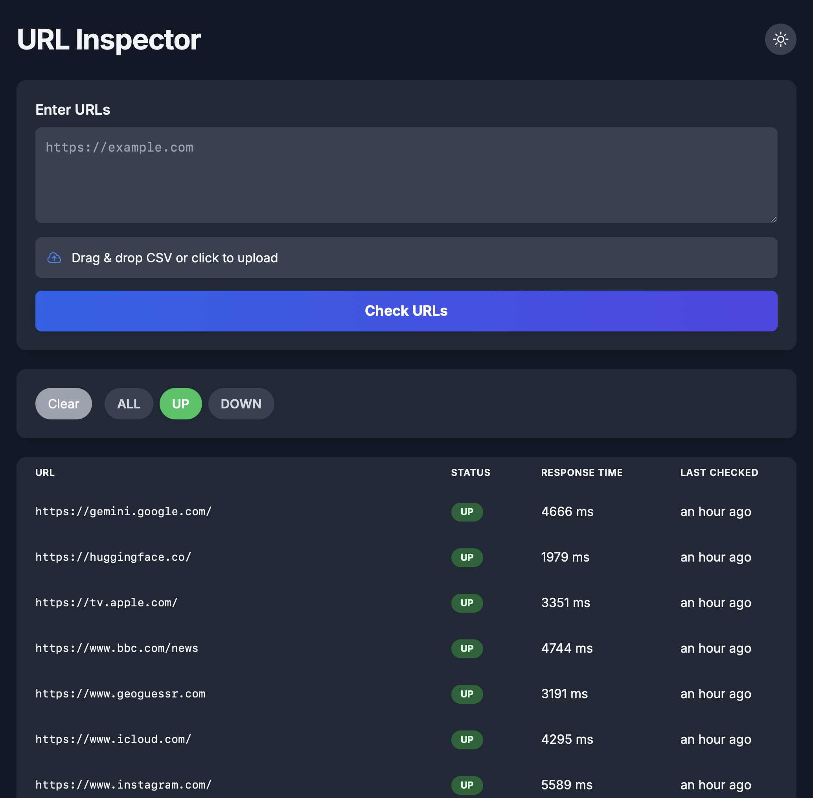
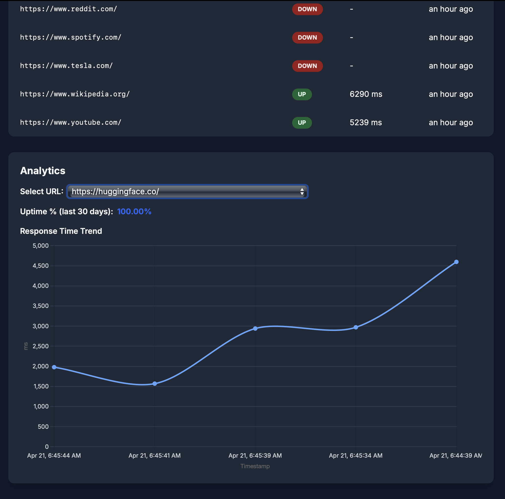

# URL Inspector

A full-stack web app to monitor the health of websites, providing real-time status, response times, and analytics. Built for reliability and developer productivity.

---

## 🚀 Project Overview

**URL Inspector** is a modern, production-ready web application for monitoring the health of any number of websites or APIs. It provides:
- Real-time UP/DOWN status checks
- Response time tracking
- Historical analytics (uptime %, response trends)
- A beautiful, responsive UI
- Developer-friendly architecture

---

## 🌐 Live Demo Screenshot

<!-- Place a screenshot of the web app UI here -->

---

## ✨ Features
- Input multiple URLs (textarea or CSV upload)
- View UP/DOWN status, response times, and last-checked timestamp
- Analytics: uptime %, response time trends (with charts)
- Filter by status (e.g., show only DOWN URLs)
- Responsive, mobile-friendly design
- Dark/Light mode toggle

---

## 🏗️ Architecture & Tech Stack
- **Frontend:** React, TailwindCSS, Chart.js, Day.js
- **Backend:** FastAPI, PostgreSQL, SQLAlchemy, httpx (async)
- **DevOps:** Docker, Docker Compose

---

## ⚙️ How It Works

1. **User Input:** Enter URLs or upload a CSV in the web UI.
2. **Health Checks:** Backend performs async HTTP checks for all URLs in parallel, measuring status and response time.
3. **Data Storage:** Each check is saved in the PostgreSQL database with a timestamp.
4. **Status Table:** Frontend fetches the latest check for each URL and displays it in a sortable, filterable table.
5. **Analytics:** Users can view uptime percentage and response time trends for any URL, visualized with charts.
6. **Timezone Handling:** All timestamps are stored in UTC and displayed in the user's local time.

---

## 🏁 Quick Start

1. **Clone the repo:**
   ```bash
   git clone <your-repo-url>
   cd url-inspector
   ```
2. **Start all services:**
   ```bash
   docker-compose up --build
   ```
3. **Access the app:**
   - Frontend: http://localhost:3000
   - Backend API docs: http://localhost:8000/docs

---

## 🛠️ Development

- Frontend: `cd frontend && npm start`
- Backend: `cd backend && uvicorn app.main:app --reload`
- Database: PostgreSQL (see `docker-compose.yml` for config)

---

## 📂 Codebase Structure

- `/frontend` — React app (UI, charts, API calls)
- `/backend/app/main.py` — FastAPI app (API endpoints)
- `/backend/app/crud.py` — Core logic for checking URLs, analytics, and DB operations
- `/backend/app/models.py` — SQLAlchemy models
- `/backend/app/db.py` — DB connection setup
- `/docker-compose.yml` — DevOps setup

---

## 📈 Analytics Example

- Uptime % and response time trends are calculated from the last 100 checks for each URL.
- Data is visualized in the dashboard for easy monitoring.

---

## 📝 Notes
- No Celery or background workers: all checks are async and handled directly by FastAPI.
- Redis is not required.
- Easily extensible for new features (alerts, auth, etc).

---

## 📸 Screenshot





---

## 📄 License

MIT
